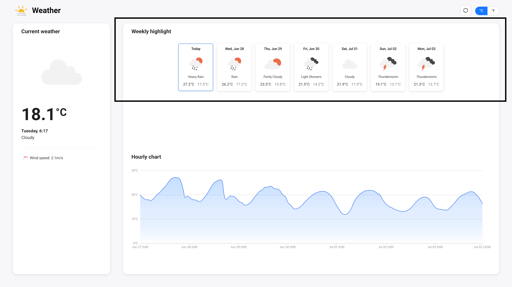
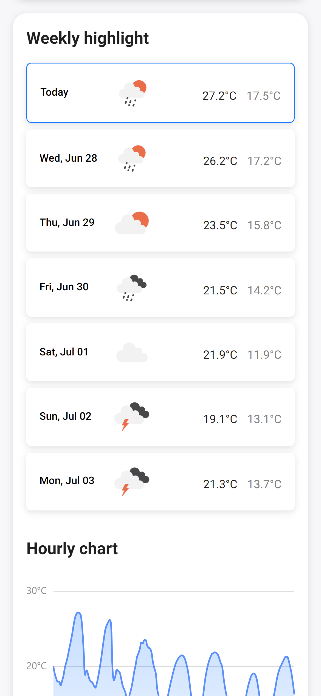
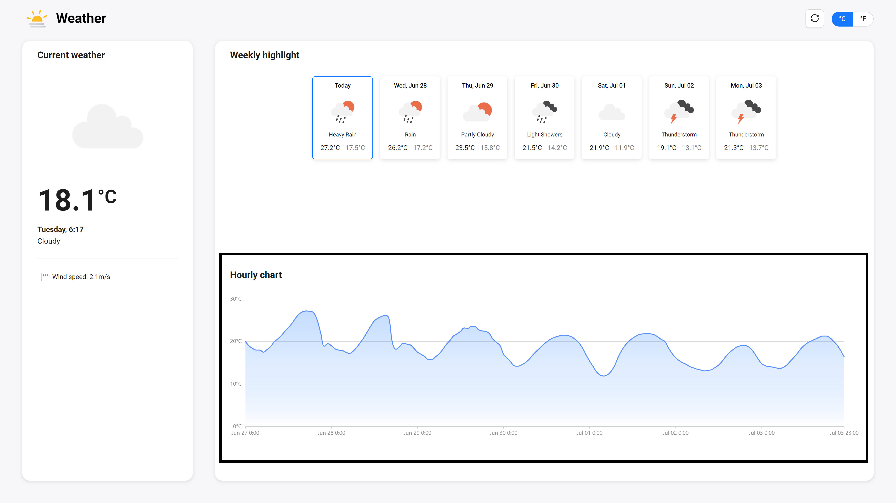

# Application features

## 1. Display current weather data

The application will display the current weather with the following data:

- Weather condition illustration with an image
- Temperature with unit
- Current time
- Weather condition description
- Wind speed

#### **Desktop screenshot**

#### **Mobile screenshot**

## 2. Display weekly weather forecast data

A 7-day forecast will be illustrated in the series of cards with the following data:

- Date
- Weather condition illustration with an image
- Weather condition description
- Max and min temperature with the unit

When a weather card is clicked, a detailed modal with additional weather data (Wind speed and UV index) and an hourly temperature area chart will be shown (24-hour forecast).

#### **Desktop screenshot**

#### **Mobile screenshot**

## 3. Display hourly temperature 7-days forecast data

168 hourly forecast data records in total will be illustrated in an area chart.
The end user could hover over the chart in order to see the temperature at the given hour.

#### **Desktop screenshot**

#### **Mobile screenshot**

